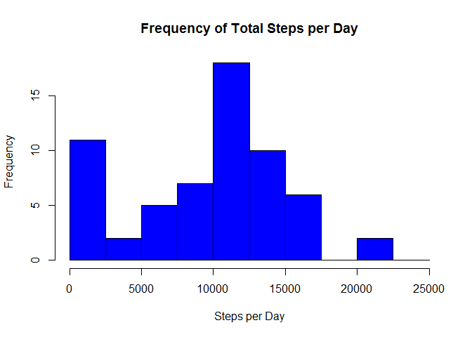

# Reproducible Research: Peer Assessment 1

This report was made as part of an assignment in the Coursera *Reproducible Research* course.


## Loading and preprocessing the data


```r
activity_table <- read.table("activity.csv",
                       header=TRUE,
                       sep=",",
                       stringsAsFactors = FALSE,
                       colClasses = c("numeric","Date","numeric"))
```


## What is mean total number of steps taken per day?

For this part of the assignment, the missing values in the dataset are ignore.

1. Calculate the total number of steps taken per day


```r
total_steps <- aggregate(activity_table$steps,list(date=activity_table$date),sum,na.rm=TRUE)
```

2. Make a histogram of the total number of steps taken each day


```r
hist(total_steps$x,
     main="Frequency of Total Steps per Day",
     breaks = seq(from=0,to=25000,by=2500),
     col="blue",
     xlab="Steps per Day",
     ylab="Frequency")
```

 

3. Calculate and report the mean and median of the total number of steps taken per day


```r
steps_mean <- mean(total_steps$x,na.rm=T)
steps_median <- median(total_steps$x,na.rm=T)
```

```
## [1] "The Mean number of steps per day is 9354"
```

```
## [1] "The Median number of steps per day is 10395"
```


## What is the average daily activity pattern?

1. Make a time series plot (i.e. type = "l") of the 5-minute interval (x-axis) and the average number of steps taken, averaged across all days (y-axis)


```r
#Format the time interval
int_hours <- activity_table$interval %/% 100
int_hours <- ifelse(int_hours < 10,paste("0",int_hours,sep=""),int_hours)
int_mins <- activity_table$interval %% 100
int_mins <- ifelse(int_mins < 10,paste("0",int_mins,sep=""),int_mins)
int_time <- paste(int_hours,":",int_mins,sep="")
int_time <- strptime(int_time,format="%H:%M")

#Add the time variable back into the original data set
activity_table <- cbind(activity_table, int_time)

#Compute the mean number of steps for each time interval and plot the result
plot_data <- aggregate(activity_table$steps, list(int_time=activity_table$int_time),mean,na.rm=TRUE)
plot(plot_data$int_time, plot_data$x,
     type = "l",   
     main = "Average Steps per Interval",
     xlab = "Interval",
     ylab = "Average Steps")
```

 

2. Which 5-minute interval, on average across all the days in the dataset, contains the maximum number of steps?


```r
max_steps <- max(plot_data$x)
int_max_steps <- plot_data$int_time[plot_data$x == max_steps]
```


```
## [1] "The 5-minute interval with the maximum number of steps per day occured at 2015-05-15 08:35:00"
```

```
## [1] "The maximum number of steps per day is 206"
```


## Imputing missing values

There are a number of days/intervals where there are missing values (coded as NA). The presence of missing days may introduce bias into some calculations or summaries of the data.

1. Calculate and report the total number of missing values in the dataset (i.e. the total number of rows with NAs)


```r
count_NA <- sum(is.na(activity_table$steps))
```


```
## [1] "The total number of missing values in the dataset is  2304"
```

2. Devise a strategy for filling in all of the missing values in the dataset. The strategy used is to replace the missing values with the mean for that 5-minute interval.


```r
copy_table <- as.data.frame(activity_table)

mean_per_interval <- aggregate(activity_table$steps,list(interval=activity_table$interval),mean,na.rm=TRUE)
```

3. Create a new dataset that is equal to the original dataset but with the missing data filled in.


```r
# Replace NA data with the means from 'means per interval' data frame for each corresponding interval
for (i in 1:nrow(copy_table)) {
  if (is.na(copy_table[i,"steps"])) {
    intervalToSearch <- copy_table[i,"interval"]
    value <- mean_per_interval[mean_per_interval$interval == intervalToSearch, "x"]
    copy_table[[i,"steps"]] <- value
  }        
}
```

4. Make a histogram of the total number of steps taken each day and Calculate and report the mean and median total number of steps taken per day. Do these values differ from the estimates from the first part of the assignment? What is the impact of imputing missing data on the estimates of the total daily number of steps?


```r
copy_table_steps <- aggregate(copy_table$steps,list(date=copy_table$date),sum,na.rm=TRUE)

hist(copy_table_steps$x,
     main="Frequency of Total Steps per Day",
     breaks = seq(from=0,to=25000,by=2500),
     col="MAGENTA",
     xlab="Steps per Day",
     ylab="Frequency")
```

 

```r
copy_table_steps_mean <- mean(copy_table_steps$x,na.rm=T)
copy_table_steps_median <- median(copy_table_steps$x,na.rm=T)
```


```
## [1] "The Mean number of steps per day is 10766"
```

```
## [1] "The Median number of steps per day is 10766"
```


## Are there differences in activity patterns between weekdays and weekends?

For this part the weekdays() function may be of some help here. Use the dataset with the filled-in missing values for this part.

1. Create a new factor variable in the dataset with two levels - "weekday" and "weekend" indicating whether a given date is a weekday or weekend day.


```r
copy_table$dateType <- ifelse(as.POSIXlt(copy_table$date)$wday %in% c(0, 6), 
                                    'Weekday', 
                                    'Weekend')
```

2. Make a panel plot containing a time series plot (i.e. type = "l") of the 5-minute interval (x-axis) and the average number of steps taken, averaged across all weekday days or weekend days (y-axis). See the README file in the GitHub repository to see an example of what this plot should look like using simulated data.


```r
dataByDayOfWeek <- aggregate(x = list(avgSteps = copy_table$steps), 
                             by = list(interval = copy_table$interval, 
                                       DayOfWeek = copy_table$dateType), 
                             FUN = mean, 
                             na.rm = TRUE)
library(ggplot2)

ggplot(data = dataByDayOfWeek, 
       aes(as.integer(interval), avgSteps)) + 
  geom_line(color="MAGENTA", size = 1) +
  facet_wrap(~ DayOfWeek, nrow = 2, ncol = 1) +
  ggtitle("Time-Series for Average Number of Steps Per Intervals\n(NA Value Removed)\n") + # Main title
  theme(plot.title = element_text(size = 14, face = "bold")) + 
  xlab("\n5-Minute Interval") + # X-axis label
  ylab("Average Number of Steps Taken\n") # Y-axis label
```

 
